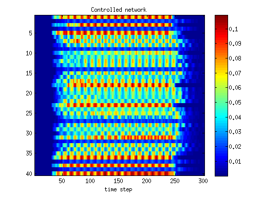
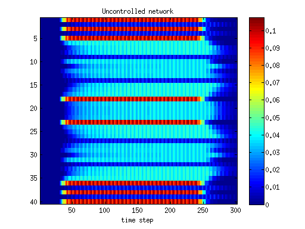

# Traffic macro-simulator

This is a MatLab package that can be used to create and simulate road networks objects described by a macroscopic dynamics. The code comes entirely from the legacy code developed during the Ph.D. of the author; all technical details can be checked in the Ph.D. thesis available [here](https://www.dropbox.com/s/9m2ldonki5x6lfq/ControlLargeScaleTraffic.pdf).

## Reproducibility of this work

[Reproducibility](https://en.wikipedia.org/wiki/Reproducibility#Reproducible_research) is an important feature, sadly often neglected in published works. When using this repository, other than checking the above mentioned thesis for a deeper insight, we provide two fully reproducibile examples (with images generation), to ease the understanding of the code. Thus, in the folder [reproducible example](./reproducibleExamples) you will find

- A runnable script to simulate one road network and instructions about how to set up your experiments,
- A runnable script to simulate two different networks, one with optimized traffic lights and one without; the script produces several figures in order to compare the systems' performance.

## About the controllers

The above mentioned Ph.D. work was about "Control of large scale traffic networks". Differently said, our objective was not just to simulate dynamic networks, but also to design algorithms to improve the behavior, for instance by reducing the congestions; the developed controllers are stored in the subfolder [controllers](./controllers)

## Requirements
- Any recent version of MatLab should work
- [YALMIP](https://yalmip.github.io/)
- Some good numerical solvers: most of the algorithms are based on convex optimization, for which you can use built-in solvers, or external solvers like cvx, mosek, etc. Other controllers are instead based on integer optimization, therefore an appropriate solver is needed (here again, mosek will work).

### Disclaimer
The code comes entirely from the legacy work of the author during his Ph.D. Therefore, some functions might not work as expected together with the rest of the package. The functions that have not been tested recently will have a related comment in their headings

## Examples

When running the networkComparisons script, you will see the following two figures (among others)

- 
- 

The figures show how the density of vehicles in every road (with roads indexes from 1 to 40 in the y-axis) evolves along the entire simulation time (x-axis). By comparing the two, it is possible to see the the controllers spreads out the severe congestions (that appear in the uncontrolled case) by creating a more homogeneous distribution of vehicles all over the network.

## Contributors

The code has been entirely written by Pietro Grandinetti.
